# Schema ER Diagrams

ER diagrams for each tool’s LinkML schema. Tools with multiple version
subsets show per-version sub-tabs.

## Tools

- Alignments
- Amber
- Bamtools
- Chord
- Cider
- Cobalt
- Cuppa
- Esvee
- Flagstats
- Isofox
- Lilac
- Linx
- Neo
- Peach
- Purple
- Sage
- Sigs
- Teal
- Virusbreakend
- Virusinterpreter







#### v1.4


#### latest






#### v1.25


#### latest




#### v4.0


#### latest


#### v3.4.4


#### latest





#### v1.3


#### latest

